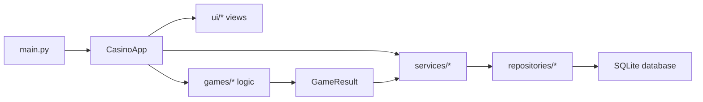

# Dym Dym Casino

<p align="center">
  <strong>Desktop casino app with roulette, slots, local progress, animation, sound and a portable Windows build.</strong>
</p>

<p align="center">
  
  
  
  
</p>

<p align="center">
  <a href="#english">English</a> ·
  <a href="#russian">Русский</a>
</p>

## English

### Overview

**Dym Dym Casino** is a polished desktop casino simulator built with Python and Flet. It includes a dark interface, animated roulette, animated slot reels, sound control, persistent player balance, game statistics and a ready PyInstaller command for creating a portable Windows `.exe`.

### Features

- **Main menu** with balance, games played, wins and sound control.
- **Roulette** with European wheel order, number/color/even-odd bets and animated ball movement.
- **Slots** with three reels, animated spin, configurable symbols and payout table.
- **Persistent state** stored locally in SQLite: profile, balance, statistics and settings.
- **Sound service** with a toggle saved between launches.
- **Centralized configuration** in `settings.py` for timings, window size, payouts and game rules.
- **Portable Windows build** via PyInstaller with bundled assets.

### Tech Stack

| Area | Technology |
| --- | --- |
| Language | Python |
| UI | Flet |
| Storage | SQLite |
| Build | PyInstaller |
| Architecture | Models, repositories, services, UI views, game classes |

### Quick Start

```powershell
python -m venv .venv
.\.venv\Scripts\Activate.ps1
pip install -r requirements.txt
python main.py
```

The app starts from `main.py`, creates the Flet window and loads `CasinoApp` from `ui/app_view.py`.

### Build EXE

```powershell
python -m PyInstaller --onefile --windowed --name Casino --distpath dist --workpath build --add-data "assets;assets" --noupx --clean --noconfirm main.py
```

After the build:

- `dist/Casino.exe` is the finished portable app.
- `build/` contains temporary build files.
- `Casino.spec` stores the PyInstaller build configuration.
- `assets/` is bundled into the executable so sounds work in the packed app.

`--noupx` is used because it avoids extra binary compression issues with bundled desktop dependencies.

### Project Structure

```text
casino/
├── assets/                 # sound and other static files
├── database/               # SQLite connection and table creation
├── games/                  # roulette and slots business logic
├── models/                 # data classes and domain entities
├── repositories/           # database read/write layer
├── services/               # app state, logs and sound
├── ui/                     # Flet screens and interface helpers
├── main.py                 # application entry point
├── settings.py             # central project configuration
├── requirements.txt        # Python dependencies
└── Casino.spec             # PyInstaller build file
```

### Architecture



### Game Logic

**Roulette** uses the configured European wheel order from `settings.py`. A player can bet on a concrete number from `0` to `36`, a color or parity. The visual spin is handled separately from the result calculation: `RouletteGame` decides the result, while `RouletteView` and `CasinoApp` animate the wheel and ball.

**Slots** use configurable symbols and payout rules:

| Match | Multiplier |
| --- | --- |
| 2 matching symbols | x2 |
| 3 matching symbols | x5 |

Spin duration and visual speed are controlled by `SLOTS_SPIN_DURATION_SECONDS` and `SLOT_SPIN_STEPS_PER_SECOND` in `settings.py`.

### Data Storage

The app creates a local SQLite database at:

```text
database/app.db
```

It stores the player profile, current balance, total games played, wins, total winnings and sound setting.

## Russian

### Обзор

**Dym Dym Casino** — это desktop-приложение на Python и Flet в формате казино-симулятора. В проекте есть тёмный интерфейс, анимированная рулетка, анимированные слоты, переключатель звука, сохранение баланса игрока, статистика игр и готовая команда для сборки Windows `.exe`.

### Возможности

- **Главное меню** с балансом, количеством игр, победами и переключателем звука.
- **Рулетка** с европейским порядком чисел, ставками на число, цвет, чётное и нечётное.
- **Слоты** с тремя барабанами, анимацией прокрутки, настраиваемыми символами и таблицей выплат.
- **Сохранение состояния** в локальной SQLite-базе: профиль, баланс, статистика и настройки.
- **Звук** с переключателем, который сохраняется между запусками.
- **Единый конфиг** в `settings.py`, где лежат тайминги, размер окна, выплаты и правила игр.
- **Сборка в Windows EXE** через PyInstaller с добавлением папки `assets`.

### Технологии

| Часть проекта | Технология |
| --- | --- |
| Язык | Python |
| Интерфейс | Flet |
| Хранение данных | SQLite |
| Сборка приложения | PyInstaller |
| Архитектура | Models, repositories, services, UI views, game classes |

### Быстрый запуск

```powershell
python -m venv .venv
.\.venv\Scripts\Activate.ps1
pip install -r requirements.txt
python main.py
```

Приложение запускается из `main.py`: там создаётся окно Flet и подключается главный класс `CasinoApp` из `ui/app_view.py`.

### Сборка EXE

```powershell
python -m PyInstaller --onefile --windowed --name Casino --distpath dist --workpath build --add-data "assets;assets" --noupx --clean --noconfirm main.py
```

После сборки:

- `dist/Casino.exe` — готовая программа.
- `build/` — временные файлы сборки.
- `Casino.spec` — конфигурация сборки PyInstaller.
- `assets/` добавляется внутрь приложения, чтобы звук работал в собранной версии.

Флаг `--noupx` отключает дополнительное сжатие библиотек и помогает избежать проблем с desktop-зависимостями.

### Структура проекта

```text
casino/
├── assets/                 # звуки и статические файлы
├── database/               # подключение SQLite и создание таблиц
├── games/                  # логика рулетки и слотов
├── models/                 # классы данных и сущности проекта
├── repositories/           # слой работы с базой данных
├── services/               # состояние приложения, логи и звук
├── ui/                     # экраны Flet и помощники интерфейса
├── main.py                 # точка входа в приложение
├── settings.py             # главный конфиг проекта
├── requirements.txt        # зависимости Python
└── Casino.spec             # файл сборки PyInstaller
```

### Архитектура


### Игровая логика

**Рулетка** использует европейский порядок чисел из `settings.py`. Игрок может поставить на конкретное число от `0` до `36`, на цвет или на чётность. Расчёт результата и визуальная анимация разделены: `RouletteGame` считает результат, а `RouletteView` и `CasinoApp` отвечают за движение шарика и обновление интерфейса.

**Слоты** используют настраиваемые символы и таблицу выплат:

| Совпадение | Множитель |
| --- | --- |
| 2 одинаковых символа | x2 |
| 3 одинаковых символа | x5 |

Длительность прокрутки и визуальная скорость слотов настраиваются через `SLOTS_SPIN_DURATION_SECONDS` и `SLOT_SPIN_STEPS_PER_SECOND` в `settings.py`.

### Хранение данных

Приложение создаёт локальную SQLite-базу:

```text
database/app.db
```

В ней хранятся профиль игрока, текущий баланс, количество сыгранных игр, победы, общий выигрыш и настройка звука.
